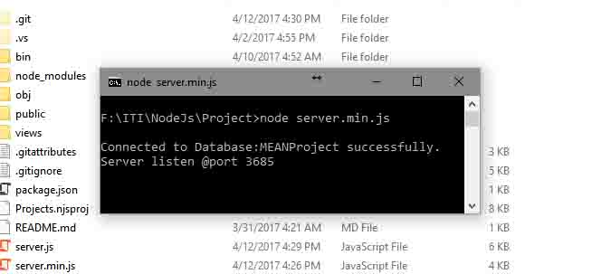

# Reservation System Project
<h5>ITI - MEAN Stack Project (MongoDB, Express, AngularJS, Node.js)</h5>
<h3>Reservation system</h3>

<h5>Usage:</h5>
1. Download project 
2. Run MongoDB server 
3. Open command prompat in prject folder 
4. Write this command "node server.min.js" 
<h6>--You should get response like in the picture--</h6>

5. Now you can enter website using this URL "http://localhost:3685"

<h5>Technologies:</h5>
- <b>MongoDB</b> 
MongoDB is the leading NoSQL database, empowering businesses to be more agile and scalable. 
- <b>Express</b> 
Express is a minimal and flexible node.js web application framework, providing a robust set of features for building single and multi-page, and hybrid web applications. 
- <b>AngularJS</b> 
AngularJS lets you extend HTML vocabulary for your application. The resulting environment is extraordinarily expressive, readable, and quick to develop. 
- <b>Node.js</b> 
Node.js is a platform built on Chrome's JavaScript runtime for easily building fast, scalable network applications.